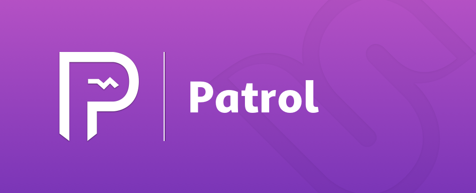

# Patrol 3
Maintenance Mode and SSL Routing for [Craft 3][craft]

## Features

###3 SSL Routing
- Force HTTPS (server agnostic)
- Force a Primary Domain (naked domain vs www prefixed)
- Define where HTTPS is enforced (if not globally)
- Configure the best redirect status code for your use case

#### Maintenance Mode
- Put your site on maintenance mode
- Define who can access the site while offline
- Control what everyone else sees (offline page or custom http response)

---

## Install
```bash
composer require selvinortiz/patrol

./craft plugin/install patrol
```

...or you can search for Patrol in the Plugin Store.

---

## Configure
You can configure some stuff through the control panel, but doing so is not recommended. File configs are much more flexible and you can define different configs for different environments.

#### Example
```php
//config/patrol.php
return [
    '*' => [
        'primaryDomain'   => '*',
        'sslRoutingEnabled' => true,
        'sslRoutingRestrictedUrls' => [
            '/{cpTrigger}',
        ],
        'maintenanceModeEnabled' => false,
        'maintenanceModePageUrl'  => '/offline',
        'maintenanceModeAuthorizedIps'   => [
            '::1',
            '127.0.0.1',
        ],
    ],
    'dev' => [
        'sslRoutingEnabled' => false,
    ]
    'staging' => [
        'maintenanceModePageUrl' => null, // Won't show a page
        'maintenanceModeExceptionStatusCode' => 410 // Gone away!
    ],
    'production' => [
        'maintenanceModeRedirectStatusCode' => 503 // Service Unavailable
    ]
];

```

### Config Legend

#### `$primaryDomain`

Allows you to enforce a primary domain to avoid duplicate content penalties.

_Say that you're hosting you website at **Fortrabbit** and your App URL is my-staging-server.frb.io and you have routed your domain my-site.com. Both of those URLs are accessible and they show the same content. In Patrol, you could set the primary domain to my-site.com and anytime my-staging-server.frb.io is requested, it will be routed to my-site.com._

#### `$sslRoutingEnabled`
Tells Patrol to force requests to be made over `https://`

#### `$sslRoutingRestrictedAreas`
Tells Patrol _where_ `https://` should be enforced. Default is `/`, which means everywhere.

#### `$maintenanceModeEnabled`
> Defaults to `false`

Tells Patrol that your site is on maintenance mode and it should start routing traffic differently.

Authorized users will see your site while unauthorized users will see either your offline page or an https response with a custom status code.

#### `$maintenanceModeRedirectStatusCode`
> Defaults to `302`

Allows you to customize the status code when redirecting to your offline page during maintenance mode.

#### `$maintenanceModeResponseStatusCode`
> Defaults to `410`

Tells Patrol what kind of `HttpException` to throw in the event that you chose not to use an offline page.

---

## @Todo
- Fix user permissions for permission based access
- Add other validators for remaining settings
- Review the way localized settings are being populated
- Review `limitCpAccessTo` functionality
- Review URL matching/parsing and redirects

### Notes
> Patrol will throw an `HttpException(403)` for unauthorized users during maintenance if you do not have an _offline page_ set up.

> To force SSL everywhere (recommended practice), you can set `/` as the restricted area. If you only want to force SSL on the control panel, you could use `/admin` or `/{cpTrigger}`, the latter is recommended.

### Help & Feedback
If you have questions, comments, or suggestions, feel free to reach out to me on twitter [@selvinortiz](https://twitter.com/selvinortiz)

## License
**Patrol** for [Craft CMS][craft] is open source software

[MIT License][mit]

![osi]

[me]:https://selvinortiz.com "Selvin Ortiz"
[mit]:http://opensource.org/licenses/MIT "MIT License"
[osi]:resources/img/osilogo.png "Open Source Initiative"
[love]:resources/img/love.png "Love"
[craft]:http://craftcms.com "Craft 3"
